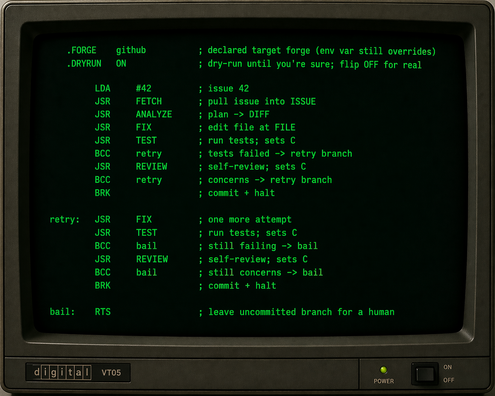

# opcode

**6502 mnemonics. Modern AI execution. Workflows as programs.**

A Claude Code skill that maps the 6502 instruction set onto a triage-and-fix loop. You write .s files. Claude executes them. Its response is also assembly. BRK means "commit and halt."

> Prose prompts invite interpretation. Assembly doesn't.

---

## Install

```bash
# Clone the repo
git clone https://github.com/newell-paul/opcode ~/.claude/skills/opcode

# Symlink so Claude finds it from any working directory
ln -s ~/.claude/skills/opcode/SKILL.md ~/.claude/skills/opcode/SKILL.md
```

Or add opcode as a user-level skill by pointing Claude Code at the directory:

```
~/.claude/skills/opcode/
  SKILL.md
  ISA.md
  OPCODES.md
  scripts/
  examples/
```

Requires `gh` (GitHub) or `glab` (GitLab) authenticated in your shell.

---

## Example — `oneshot.s`

Fetch an issue, analyze it, fix it, test it, self-review, commit. One retry branch if the first attempt fails. If both fail, leave the branch uncommitted for a human.



---

## Core ISA

15 opcodes. You can hold the whole thing in your head.

| Op | Effect |
|---|---|
| `LDA` | Load issue / slot into `A` |
| `STA` | Persist `A` to a zero-page slot |
| `LDX / INX / CPX` | Loop control |
| `JSR` | Call a vector or label |
| `BCC / BCS` | Branch on test result (C=0 fail, C=1 pass) |
| `BEQ / BNE` | Branch on empty / non-empty |
| `JMP` | Unconditional jump |
| `BRK` | Commit and halt |
| `RTS` | Return from subroutine |

**Vectors:** `FETCH` `ANALYZE` `FIX` `TEST` `LINT` `REVIEW` `PUSH` `PULL` `CLONE`

**Zero-page slots:** `$00` issue ID · `$01` branch · `$02` file · `$05` commit message · `$10–$1F` issue queue

---

## Examples

| Program | What it does |
|---|---|
| `examples/peek.s` | Fetch and analyze one issue. No commits, no edits. |
| `examples/oneshot.s` | Fetch → fix → test → review → commit, with one retry. |
| `examples/drain-the-swamp.s` | Loop all `bug` issues, fix each, commit the ones that pass. |

---

## Forges

Auto-detected from `git remote`. Optionally pin with `{"forge": "..."}` in `.opcode.json`, or override at runtime with `OPCODE_FORGE=github|gitlab|local`.

The `local` driver reads from `.opcode/todos.json` — no auth, no network, good for smoke testing.

---

## Further reading

- `ISA.md` — authoritative opcode reference
- `FORGE.md` — forge driver contract and label vocabulary
- `CLAUDE.md` — test plan and stage-by-stage smoke test guide
