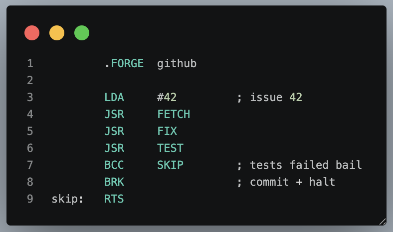
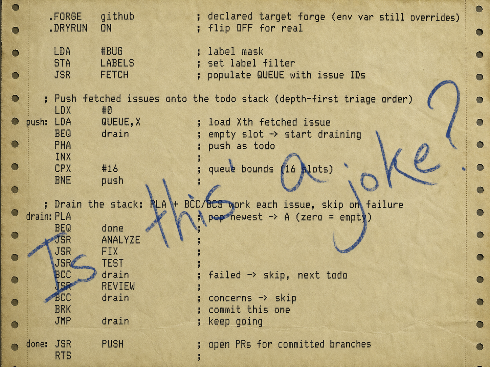

# I Programmed an AI in 6502 Assembly - it Worked.

In 1975 the 6502 moved 8-bits in and out of memory. A Claude Code skill now uses the same mnemonics to move forge tickets in and out of triage loops.

**Paul Newell** · Apr 2026 · 8 min read

---

I'll be honest, this started as a joke. I wanted to see if I could get Claude Code to understand 6502 assembly language. The 6502 powered the Apple II, the Commodore 64, the BBC Micro, the NES. It had 56 opcodes, 64KB of address space and absolutely no business anywhere near a large language model.

So I built a Claude Code skill that maps its instruction set onto a modern triage-and-fix workflow. You write `.s` files. Claude executes them. Its response is also assembly. There's a zero-page. There's a stack. `BRK` means "commit and halt."

## Same Verbs, Bigger Nouns

Forty years later I'm writing LDA to load issue 42, which arrives with a description, acceptance criteria, a set of labels, screenshots Claude can actually *see* with vision and a graph of linked PRs. 

>The verbs haven't changed. The nouns got about six orders of magnitude bigger.

## The Smallest Useful Program

 
<em>peek.s - 6502 looking very out of place in colour</em>

Six opcodes, three flags in play. This is the heart of what the whole thing does:

It's not a real 6502, of course. I just borrowed the mnemonics.

If the tests pass (`C=1`), commit and halt. If they fail (`C=0`), branch to `skip` and return without committing. That's it. The `BCC`/`BCS` pattern carries over directly from the real 6502. Carry set means success, carry clear means failure.

## The Trace Is the Reply

An 800-token prose response ("Let me analyse this issue. I'll start by examining the file at...") becomes a handful of lines of assembly trace. Issue fetched, file fixed, tests passed, diff reviewed, committed, PR opened. No "Let me now...", no "I'll proceed to...", no "Here's what I did...". Just the trace.

That trace is structured. Diffable. Greppable. Re-runnable. Whether it costs fewer tokens than prose turned out to be more complicated than I expected, but the structural value lands regardless.

## One Shot, One Fix

`oneshot.s` is the next step up: fetch an issue, analyze it, fix it, test it, self-review, and commit, with a single retry branch if the first attempt fails.

If the first fix passes tests and review, `BRK` commits immediately. If not, the retry branch gives it one more shot. If that also fails, `RTS` leaves the branch uncommitted for a human to pick up. The carry flag is doing exactly what it did on the original chip,  routing control flow on a binary result.

*oneshot.s - that's better, much easier on my old eyes*

## How It Works: 15 Opcodes and 9 Vectors

The skill is called **opcode** and it defines a semantic DSL that borrows the 6502's mnemonics but maps them onto issue triage. The core ISA is just 15 opcodes. You can genuinely hold the entire thing in your head.

`LDA` loads an issue. `STA` persists to a slot. `LDX`/`INX`/`CPX` handle loops. `JSR` calls one of nine I/O vectors: `FETCH`, `FIX`, `TEST`, `LINT`, `REVIEW`, `PUSH`, `PULL`, `CLONE`, `ANALYZE`. `BCC`/`BCS` branch on test results. `BRK` commits and halts. `PHA`/`PLA` push and pop todos from a stack that maps directly to Claude Code's task list.

There's a zero-page with named slots. `$00` is the current issue ID, `$01` is the branch name, `$02` is the current file, `$05` is the commit message. The fetched issue queue lives at `$10-$1F`. The stack page at `$0100-$01FF` *is* the Claude Code task list.

> Opcode Oriented Programming (OOP, obviously 🙂)

> 6502 mnemonics. Modern AI execution. Workflows as programs.

It talks to GitHub or GitLab through a forge abstraction layer so `JSR PUSH` opens a PR on GitHub or an MR on GitLab. Nobody has to compromise their vocabulary.

## A Real Triage Session

This program loops through every issue labelled bug, tries to fix each one and only commits the ones where tests pass and the self-review is clean. Failed fixes get skipped. At the end it opens PRs for everything that worked. The `PHA`/`PLA` cycle maps directly onto Claude Code's task list so each pushed issue becomes a real tracked todo.

*drain-the-swamp.s - in its preferred output format; complete with historically accurate code review comments*

## The Constraint Is the Feature

The 6502 aesthetic isn't just nostalgic decoration, it's a forcing function. When your output format is assembly you commit to a verb sequence before execution instead of wandering through chat mode. The resulting traces scan way faster than prose. They're diffable, greppable and versionable. You can commit a `.s` file alongside your code and re-run it on the next batch of issues.

> The temptation to add "just one sentence of context" is the whole failure mode. Resist it absolutely.

The skill is pretty militant about this. Claude's response must be a valid `.s` program. No greetings, no sign-offs, no "Let me", no markdown headers. If it doesn't fit as an instruction, a directive or a semicolon comment it doesn't get said. There are escape hatches like `.ASK` for questions (≤60 chars), `.NOTE` for observations (≤80 chars) and `.ERR` for errors. But these are pressure-release valves, not invitations to prose.

## The Extended ISA: For Completeness and Nostalgia

There's a full extended layer (~40 more mnemonics) you can opt into with `.EXTENDED ON`. Shifts become priority promotions (`ASL A` = "promote priority"). Logic ops become label-filter algebra (`AND #imm` = "intersect label mask"). `BVS` branches on merge conflict. Most of these are tagged as metaphor so they get narrated in the trace but not actually executed.

And for completeness there are six illegal opcodes behind `.UNSAFE ON`. The real undocumented 6502 ops like `LAX`, `SAX` and `DCP`. Pure flavour. Narrated, never executed, not even with the directive set. They exist simply because I could not resist adding them.

## What about tokens?

I expected the tight assembly output to translate to substantial cost savings versus prose Claude. The story turned out more nuanced.

The reason is asymmetric overhead. For small, deterministic tasks, the orchestration overhead dominates the work — like running a CI pipeline to compile a single file. Opcode comes out ahead on larger programs with more decision points (multi-issue queue walks, longer reasoning chains where prose Claude would actually ramble).

>Prose prompts invite interpretation. Assembly doesn't.

## So Is This Actually Useful?

Maybe. if you're running the same triage pattern across many issues like scanning a backlog, fixing straightforward bugs and opening PRs then the token savings start making sense and the structured output is way tighter to read than endless TL;DR prose. The `.s` files are reviewable artifacts. The traces are audit logs. And the constraint of planning your workflow as a sequence of opcodes before execution turns out to be surprisingly good discipline.

## BRK

At the end of the day the question is the same one it's always been. Are you a quiche eater or a Real Programmer? Real Programmers don't need prose. They need opcodes, a carry flag and a `BRK` at the end.

Commit the work. Halt the machine 🙂

---

## The code

Full skill and example programs: [github.com/newell-paul/opcode](https://github.com/newell-paul/opcode)

---

*Tags: Claude Code · AI · 6502 · Assembly · Developer Tools · Retro Computing · Token Optimization*
